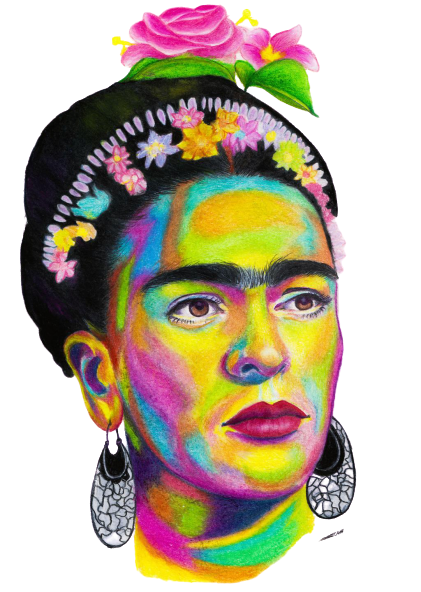
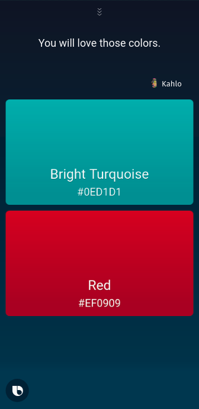
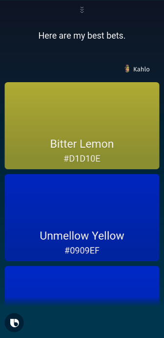

<div style="text-align: center;">
 <link href="https://fonts.googleapis.com/css2?family=Abril+Fatface&display=swap" rel="stylesheet"> 
<span  style="text-align:center; color: #f2cf4a; font-family: Abril Fatface; font-size: 3em;">Kahlo </span>
</div>

<p align="center">
    
</p>
Kahlo is a Bixby voice assistant capsule named after a famouse mexican painter Frida Kahla. Who was famouse for her sense of colours and unique artworks. Kahlo gives you color inspirations and matching color palette that can go perfectly fine with almost every color.
<br/>
<br/>
<p align="center">
    
    
 
</p>

>Sample screenshots from Bixby

Kahlo fetches data from [the color API](https://www.thecolorapi.com/) in order to get information about the matching color and displays them on the screen.


 <h3 align="center">HOW TO USE IT? </h3>
 Ask bixby the following questions to get your perfect color-match!

```
Find a color that matches red
Find a color that goes with pink
Find a color matching blue
```
